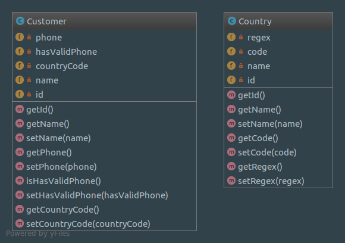
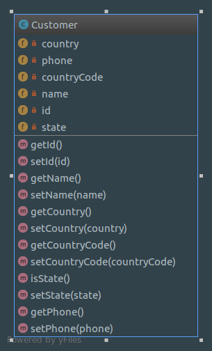
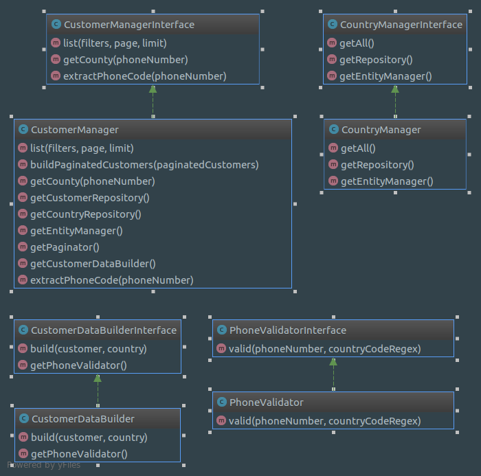

## Jumia Phone Manager

### Used stack
- php 7.3
- symfony framework
- composer
- sqlite
- nodejs
- bootstrap

### Structure 

#### Entities

#### Models

#### Services

### How to setup
- run `composer install`
- run `yarn install`
- run `yarn encore dev`
- run `php -S localhost:8888 -t public`
- then go to `http://localhost:8888/customers?countryCode=251&hasValidPhone=0`
- then run this patch `bin/console app:patch:validate-phones`

### OR using Docker
- `docker-compose up -d`
- run this patch `docker-compose exec php bin/console app:patch:validate-phones`
- then go to `http://localhost:8888/customers?countryCode=251&hasValidPhone=0`

### how to test
- run ` ./bin/phpunit` 
- or with docker `docker-compose exec php bin/phpunit`
- the all unit and integration tests in `tests` folder
- TODO (running phpunit with CI 3rd party)

### author
Mohamed Essam Fathalla (SarcasticGeek) <mohamedessamfathalla@gmail.com>
